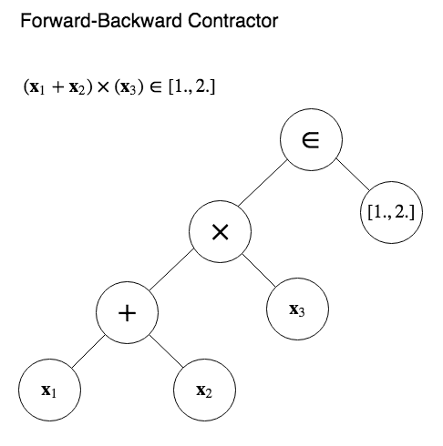
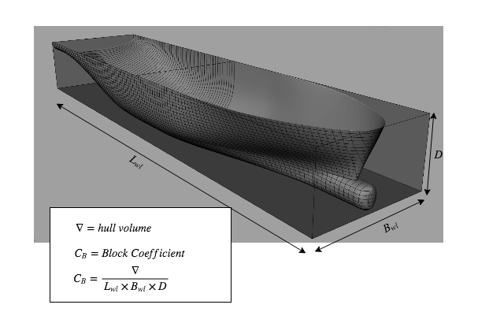
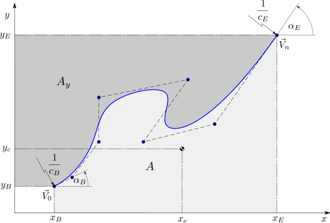
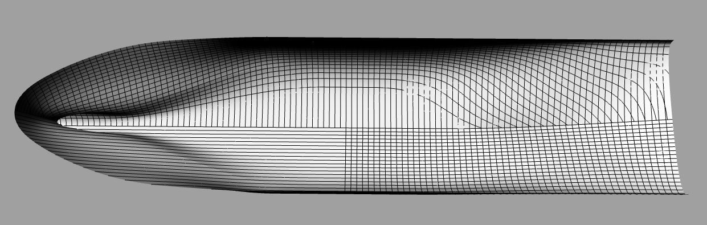

# Relational-Interval-Geometry
So what is neat about them?  They...

# Neat stuff, on the declarative design front:
1. They use declarative constraint programming to generate complex ship hull geometry from a design specification.
2. Numerical constraints are parsed into expression trees and compiled into declarative relational constaints.
3. A network of constraints is automatically built based on freely modified mathematical relations between design variables
4. Interval arithmetic is used to process constraints on the entire design space at once
5. An constraints become interval valued relations between design space parameters.
6. Constraint propagation narrows the design space to the feasible domain based on the latest design choices.
7. The solver is able to narrow the design space down to individual self-consistent design parameter vectors.
8. This is what is needed to ensure that the nonlinear solver, mentioned just below, will be successfull in 
solving for the nice looking geometry.
9. TODO: insert pictures here!  (Interval space paving, code transformation, etc..)

# So a constraint on the length, width, and height of the hull form ensures that the hull will never exceed those bounds.
1. It will be processed into a syntax tree:

2. Then compiled into declarative constriant language
3. And constraint propagation over the interval valued design space will eliminate design subspaces which violate the constraint.
4. In the end your ship hull satisfies this and more constraints which form a network

5. And many more constraints bsides.  Finally there is a constraint conforming ship hull.

# Neat stuff, on the automatic differentiation, nonlinear shape optimization front:
2. There is an automatic differentiation implementation of a nonlinear constraint solver based on Lagrange's method of multiplies.
3. This is coupled with an AD variables representation of B-spline control points
4. There is also a full B-spline library so that any quantity of a B-spline curve or surface can be automatically 
differentiated.
5. The code uses this to automatically generate the systems of equations needed for Lagrange multiplier based optimization.
6. Once the solve is complete, the geometry meets the constraints exactly and is smooth according to some energy norms.
7. TODO: insert pictures here!  (ship shapes)

# Actual ship hulls look something like this:

# Neat stuff, on the multiresolution modeling portion:
1. The solver above is nice, but we would also like to vary detail locally, without needlessly adding control points elsewhere.
2. The code uses the truncated hierarchical basis splines to make this work.
3. TODO: insert pictures here!  (the elegant THB basis, or maybe some local shape detail)

Also to help me formulate better presentations.  We will see how it goes!

### How do I get set up? ###

* First, you will need my big PhD code dump.  Sorry!  Don't focus on the mess, just install it this way:
    *  Pull the code here:
    git clone https://github.com/LukeMcCulloch/feasible-form-parameter-design
    *  Assuming dependencies are met (see below), go to the top level directory (where setup.py is found)
    and run
    > pip install .

    to install.
    *  Or
    > pip install . --upgrade
    
    to update after making changes.
    *  import relational_lsplines to access the code.
    
* Second, pull this repo.  It will contain demos and samples using pieces of my code installed above.
    *  The idea is to break out your interpreter and have fun!
    *  Isn't that always the idea??
  

## Building slides and hosting on github pages
[From here](https://medium.com/learning-machine-learning/present-your-data-science-projects-with-jupyter-slides-75f20735eb0f)

### How to build slides of a jupyter notebook
 * convert the jupyter notebook to slides:
  
   jupyter nbconvert ADdemo.ipynb --to slides --post serve

 * jupyter nbconvert ADdemo.ipynb --to slides --post serve 
--SlidesExporter.reveal_theme=serif 
--SlidesExporter.reveal_scroll=True 
--SlidesExporter.reveal_transition=none

### How to host on github pages (haven't tested this yet)

 * First clone reveal.js repo to your directory containing the notebook to add it as a submodule.

git submodule add https://github.com/hakimel/reveal.js.git reveal.js

 * Rename your notebook to index.ipynb because the nbconvert command creates a html file with the notebook name and we want to create the index.html file for our site to host on github pages.
 * Run the script in the terminal to generate index.slides.html file.

jupyter nbconvert --to slides index.ipynb --reveal-prefix=reveal.js 

 * Since I’ve added my configuration parameters I’ve used the following :

jupyter nbconvert --to slides index.ipynb --reveal-prefix=reveal.js --SlidesExporter.reveal_theme=serif 
--SlidesExporter.reveal_scroll=True 
--SlidesExporter.reveal_transition=none

 * Push them to github in a new repo and make that repository a github pages site. Easiest way to do it is to just go to settings → Github pages section → select master as source → save.
